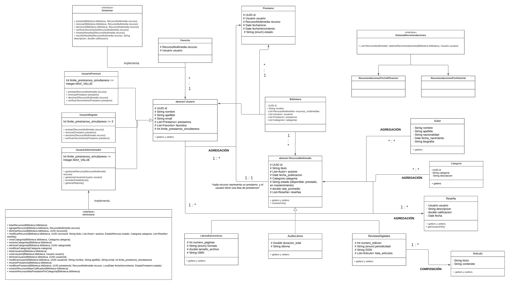

# Sistema de Biblioteca Digital

Este fue un sistema desarrollado para una entrega de *Programación Orientada a Objetos* en el primer año de la carrera Analista de Sistemas en Da Vinci.

## Consignas
Desarrollar un sistema de gestión para una biblioteca digital que maneja diferentes tipos de recursos. El sistema debe permitir a los usuarios acceder a diversos materiales digitales y a los administradores gestionar el catálogo y los préstamos.

- Requerimientos del Sistema:
1. Recursos Multimedia
Todo recurso multimedia debe tener las siguientes características base:
ID
Título
Autor/es
Año de publicación
Género/Categoría
Estado (disponible, prestado, en mantenimiento)
Calificación promedio
Lista de reseñas
Tipos específicos de recursos:
Libros Electrónicos 
Número de páginas
Formato 
Tamaño del archivo
ISBN
Audiolibros 
Duración total
Idioma
Revistas Digitales 
Número de edición
Periodicidad
ISSN
Lista de artículos
2. Sistema de Usuarios
Implementar tres niveles de usuarios:
Usuario Regular 
Nombre completo
ID de usuario
Email
Historial de préstamos
Lista de favoritos
Límite de préstamos simultáneos
Usuario Premium 
Todo lo de Usuario Regular
Sin límite de préstamos
Administrador 
Capacidad de gestionar recursos
Gestión de usuarios
Acceso a estadísticas
Gestión de reportes
3. Sistema de Préstamos
Implementar un sistema que maneje:
Fecha de inicio y fin del préstamo
Renovaciones permitidas
Estado del préstamo
Sistema de reservas
4. (Opcional)Sistema de Recomendaciones
Analice el historial de préstamos del usuario
Considere las calificaciones dadas
Use las categorías preferidas
- Funcionalidades Requeridas:
1. Gestión de Recursos 
Agregar/eliminar/modificar recursos
Búsqueda por género y autor
Sistema de categorización
2. Gestión de Usuarios 
Registro/modificación de usuarios
Sistema de permisos
Gestión de planes
3. Sistema de Préstamos 
Realizar préstamos
Gestionar devoluciones
Manejar renovaciones
Control de reservas
4. Sistema de Reportes Generar reportes de: 
Recursos más prestados por categoría
Recursos mejor calificados

# Desarrollo

## Diagrama UML realiazdo con Lucidchart

## Modelado del sistema
El diagramado del sistema fue modificado la cantidad de veces necesarias para dar con el punto de vista esperado, uno de los principales problemas fue abarcar todo lo requerido en la consigna y relacionarlo de forma que tenga coherencia, opté por la creación de listas para separar la lógica y la cantidad de atributos, accediendo a ellos mediante métodos "Getters" y "Setters".

Entre otras dudas que surgieron, una de las mas importantes fue la relación de un Prestamo y un RecursoMultimedia, ya que si bien un Prestamo puede contener una lista de recursos, decidí tratar cada recurso como un prestamo y de esta forma permitir a un usuario con privilegios gestionar cada uno de ellos de manera individual.

Utilicé métodos de Agregación y Composición en algunas partes del sistema que resultaron eficientes bajo mi punto de vista.

Lo más dificil de pensar fue el Sistema de Recomendaciones, si bien lo resolví usando una interfaz, que es implementada en dos clases donde cada una de ellas el método posee su lógica correspondiente, adaptada para que una funcione tanto para historial como para recomendaciones, aunque no termina de convencerme y probablemente en un futuro agregue algunas mejoras.

## Código
La cantidad de atributos de cada clase fue un problema leve ya que provocaba la necesidad de crear muchos métodos para obtener y actualizar cada uno de ellos, esto terminaba formando archivos de clases muy extensas y menos legible.

Por suerte utilicé una distribución de carpetas bastante sencilla:
- Constantes: Decidí usar estas variables para determinar algunos valores como la cantidad de días que puede durar un prestamo, y en caso de querer modificarla en un futuro esta sea mucho más facil de encontrar.
- Utils: Carpeta la cual contiene algunas clases que se repiten en varias partes del proyecto.
- Recomendaciones: Sistema de recomendaciones.
- Enumeraciones: Una buena forma de especificar algunos "estados" fue utilizar enumeraciones como para por ejemplo determinar el estado del prestamo, el estado del recurso, los formatos de los archivos, etc.
- Interfaces: Todas las interfaces que se implementaron en el sistema.
- Lists: Carpeta con algunas listas no tan primarias.
- Recursos: Clases relacionadas a los recursos de la biblioteca.
- Usuarios: Clases relacionadas con los usuarios del sistema. 
